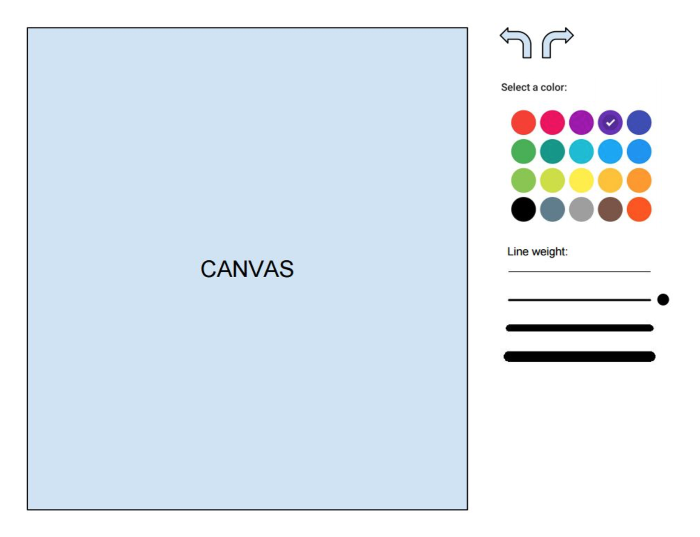

# Paint

Paint built in vanilla js with canvas

Live demo [http://giodelabarrera.paint-test.surge.sh/](http://giodelabarrera.paint-test.surge.sh/)

## Getting Started

Install the dependencies

```sh
npm i
```

Run the application in development environment

```sh
npm run watch
```

Open [http://localhost:3000](http://localhost:3000) to view it in the browser.

## TODO

- [x] Paint
- [x] Components (ES6, Webpack, Babel)
- [x] Styles (SASS)
- [ ] Eslint
- [ ] TDD [Jest](https://jestjs.io/)
- [ ] Documentation

## Paint Exercise

Tienes que hacer una aplicacion parecida al famoso paint de Microsoft ;). Esta aplicación deberá tener solo las siguientes funcionalidades:

- Deshacer/rehacer
- Selección de color
- Grueso de línea

Aquí tienes un wireframe orientativo de como podrías hacerlo. Puedes modificar el UX como creas conveniente.



Puedes usar cualquier framework, librería, etc. También puedes hacerlo en Vanilla JS ;)

Con la prueba debes entregar una serie de tests. Puedes usar cualquier setup para estos (Karma, Jasmine, etc).

## Consideraciones

Debes proponer la arquitectura a utilizar teniendo en cuenta que el proyecto debería poderse distribuir como app multidispositivo en un futuro próximo.

La aplicación va a tener un ritmo rápido de iteraciones, incorporando en las próximas semanas nuevas funcionalidades como filtros, etc.

Se valorarán decisiones de diseño sobre organización de paquetes, componentización, clean code, seguimiento de principios SOLID, etc.